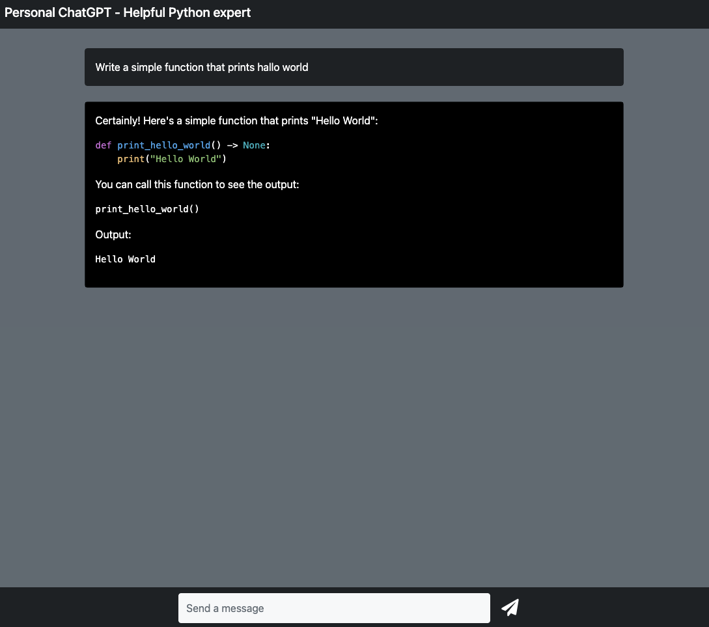

# Privat ChatGPT - Helpful Python expert
Welcome to your own "privat" hackable ChatGPT!
At the moment, its just a helpfull Python expert.
But you can hack it to be anything.

## Get OpenAPI key
And place it in a `.env` file.
```bash
OPENAI_API_KEY=<some-api-key>
```

## Install
```bash
python3 -m venv env
source env/bin/activate
```

```bash
pip install --upgraded pip
pip install -r requirements.txt
```

## Run it
```bash
python app.py
```
Go to `localhost:8000`

